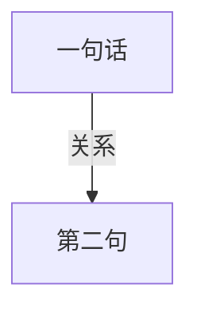
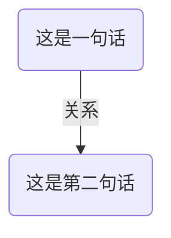

# 笔记软件测评合集

我曾经介绍过的笔记软件，各种新型笔记软件、双链笔记软件全都有！！！

有空我得综合起来，做个大项目！！！（综合测评之类的）

（主要早就发其他平台上了，我这博客相当于一个中转站算了，给个链接，想看的就看看吧）

## 文章列表
### 个人想法

- 双链笔记使用
	- <a target="_blank" href="https://mp.weixin.qq.com/s?__biz=MzU4MjY5OTM5OQ==&mid=2247485288&idx=2&sn=090d9a7d3054f7dda717c3584114a5bc&chksm=fdb51780cac29e960fcd53701c1993dfb38ef7ccfa3c3275a938e8596a22f859144e1996c05b&token=84766434&lang=zh_CN#rd">使用双链笔记软件是否要对笔记内容分类？</a>
### 介绍软件
- 幕布
	- 虽然说我会员还有十几年才过期，但是现在不再推荐。
- （幕布的平替）
	- <a target="_blank" href="https://mp.weixin.qq.com/s?__biz=MzU4MjY5OTM5OQ==&mid=2247485382&idx=1&sn=10a70f65b9c61e0e4c5256273e1ee3d0&chksm=fdb5172ecac29e38dc9a86068c499e1d75507e9b0e6b8644c0cadcc4b5341877b7cef1fd6549&token=84766434&lang=zh_CN#rd">幕布的平替软件（国产双链大纲笔记软件）</a>
- 幕布原团队创业新产品
	- <a target="_blank" href="https://mp.weixin.qq.com/s?__biz=MzU4MjY5OTM5OQ==&mid=2247485355&idx=1&sn=82346ac00020e3395354ac4699618a30&chksm=fdb51743cac29e5529118f87b0f1d27b96bf46278bebf7a7e9fd91e4c639e26f60eaced2851f&token=84766434&lang=zh_CN#rd">氢刻——可提醒复习的卡片笔记</a>
	

## 软件相关资讯
### 幕布不更新了
我写过文章来着：

[还好：幕布不更新很久了，听说了一些事](https://zhuanlan.zhihu.com/p/487510940)

### 幕布的平替
最近还更新了幕布的平替软件，想看的可以看，不想看的可以忽略。

[幕布的平替软件（国产双链大纲笔记软件）​](https://mp.weixin.qq.com/s?__biz=MzU4MjY5OTM5OQ==&mid=2247485382&idx=1&sn=10a70f65b9c61e0e4c5256273e1ee3d0&chksm=fdb5172ecac29e38dc9a86068c499e1d75507e9b0e6b8644c0cadcc4b5341877b7cef1fd6549&token=1503143501&lang=zh_CN#rd)

反正我个人一直在用，而且幕布的层级可以迁移过去，还不错。虽然其他的软件也可以复制，但是无法导出或者无法再复制，基本上都处于一种所谓宽进严出的状态。我现在非常需要支持markdown的软件（不是所谓的markdown语法就够了，而是必须支持导出markdown，不支持的我就跑路，而且最好有能够支持md格式的离线版本，因为其他的格式即使能批量导出，但我手机上的编辑器识别不了就没用），反正这款就正好同时支持在线版和离线版，离线版就全都是markdown格式了，想转移就能转移，挺好的。

感觉有用可以点赞。

## 测试

