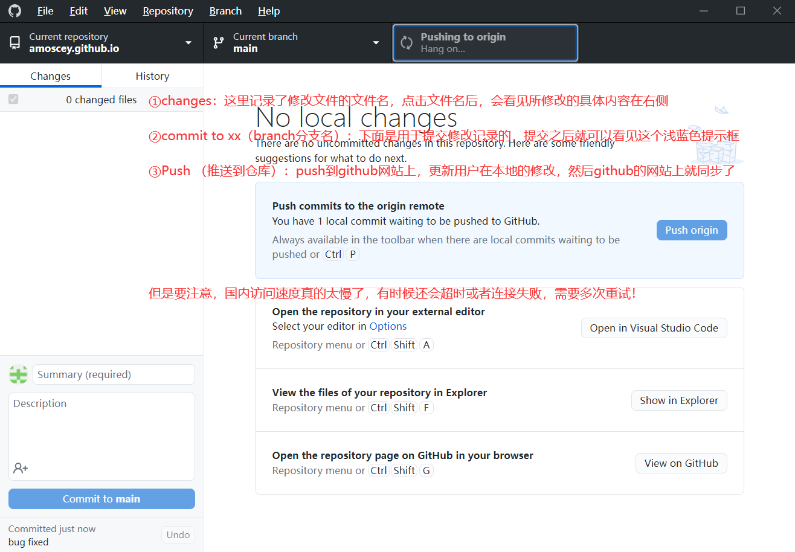

# GithubDesktop流程图示

## 关于配置
- 首先得有一个github账号，记得先注册
- 然后就是下载github的软件：GithubDesktop

## 同步步骤

①changes：这里记录了修改文件的文件名，点击文件名后，会看见所修改的具体内容在右侧
②commit to xx（branch分支名）：下面是用于提交修改记录的，提交之后就可以看见这个浅蓝色提示框
③Push （推送到仓库）：push到github网站上，更新用户在本地的修改，然后github的网站上就同步了

### 注意
- 但是要注意，国内访问速度真的太慢了，有时候还会超时或者连接失败，大概率需要多次重试！

## 界面流程简单概述

# `end`
